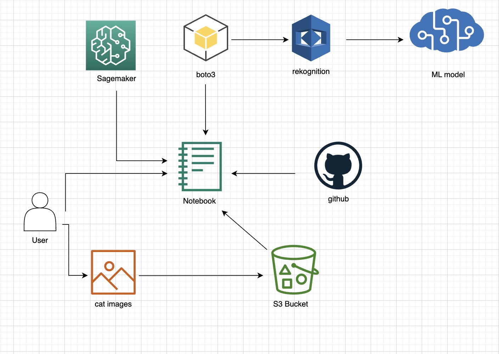

# AWS-ML-Eval

## Background
We are interested in cat recognition because sometimes we cannot find our cats at home. They like to hide so we would like to use AWS recognition. Given the fact that human face recognition is so well-developed that elements of classes or hats are included in the recognition process. However, we don’t know for sure if object recognition will take that into account also. Therefore, we want to use different angles and decorated pictures of Icy and Jenny’s cat to run the recognition experiment.

## API
Amazon Rekognition Image API is able to detect labels in pictures. A label is defined as an object, scene, action or concept in the image or video based on the content. The Amazon Rekognition Image applies a hierarchical taxonomy of ancestor labels to identify and classify labels. In our process of recognition experiment, we are going to identify the labels in the picture of Icy’s cat. The labels of the cat’s picture are categorized into three main categories: the part of the cat shown in the picture (Whole cat/ head/ body/ tail/ feet), the color of the cat (black/ gray/ orange), the background (chaotic/ plain).

## Structure
